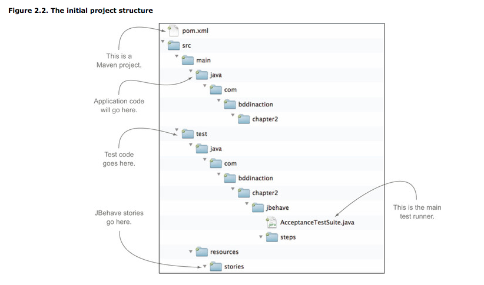
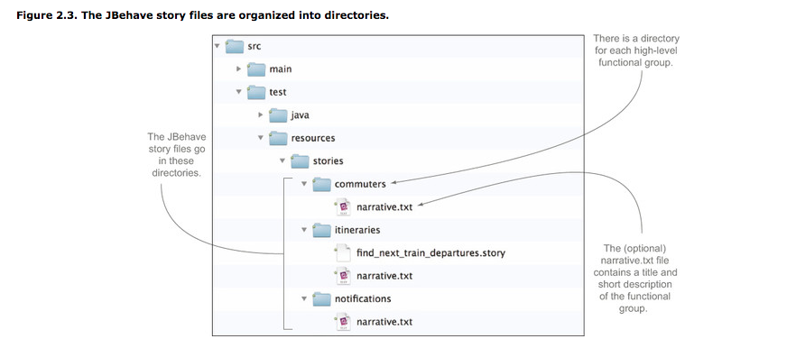
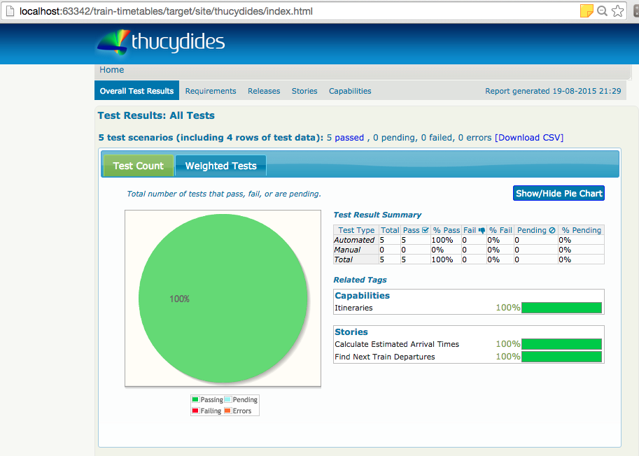

## chapter-2

- This code can be downloaded from [here](https://github.com/bdd-in-action/chapter-2.git).

- We have modified the project as per our need.

- The project structure is like below

- The stories are arranged inside **src/test/resources/stories** like below

- To run the tests, run the command: **mvn verify**

- Above will generate report inside target/site/thucydides/index.html which will look like below

### Importing project in IntelliJ

- Import this project "train-timestables" as maven project

- IntelliJ will recommend you to download JBehave plugin, so do that.

### Project Explanation

- 

